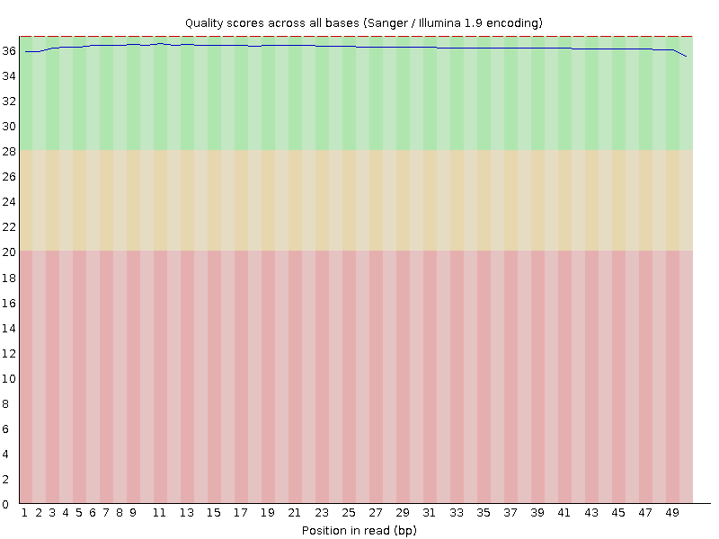
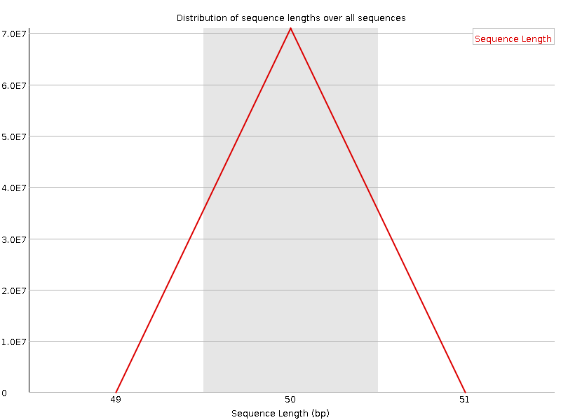
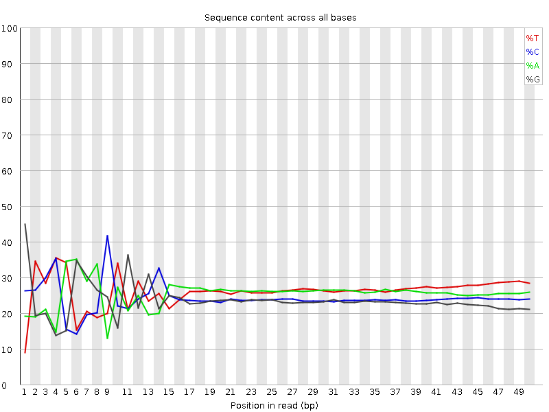
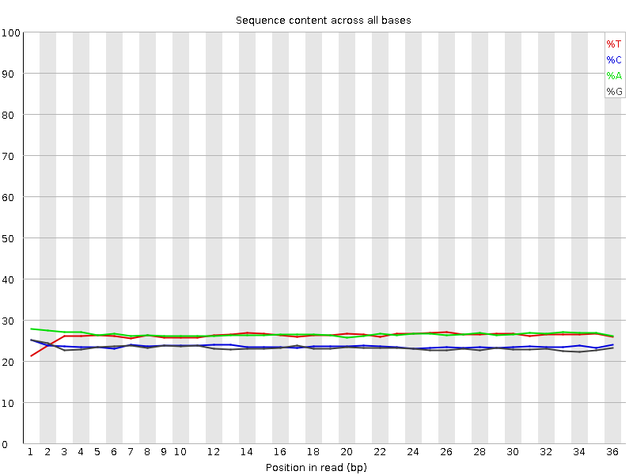
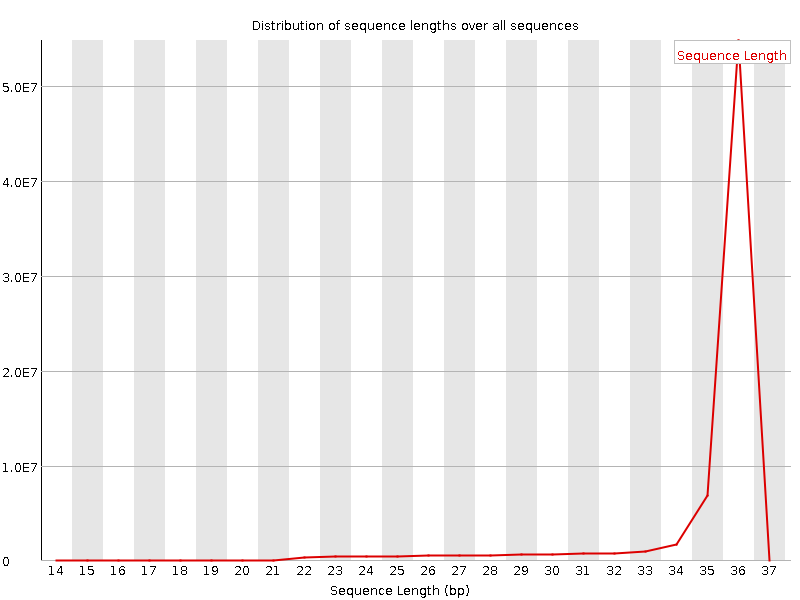

# Background

The purpose of this workflow is to complete basic data cleaning of ATAC-seq chromatin availability data. This includes 1) adapter removal, 2) alignment, 3) peak calling, 4) peak filtering, and 5) annotation.

# Setup

Load packages.

```{r message=FALSE, results=FALSE}
# Tabular data manipulation and plotting
library(tidyverse)
library(cowplot)

# GRanges objects
library(ChIPQC)
# Peak annotation
library(ChIPseeker)
# TSS plots
library(soGGi)

# Count normalization
library(edgeR)
library(limma)

# Print pretty tables to Rmd
library(knitr)
library(kableExtra)
```

Set seed.

```{r}
set.seed(589)
```

#### Note on installation

While this document was made in R/RStudio, many of tools used are Linux command line programs run outside of R. See `ATAC_pipeline_setup.sh` for details

# Data cleaning in the terminal

The full data cleaning pipeline can be found in `ATAC_pipeline.sh`. Only summaries and results are provided in this document.

## Initial quality assessment
Assess read quality using [FastQC](https://www.bioinformatics.babraham.ac.uk/projects/fastqc/). Save results in `results/results_fastqc/fastqc_raw/`.

#### Example: RS10252, read 1

Overall, read quality is high with Phred scores > 35 (upper left), no ambiguous bases pairs (upper right), and full lengths around 50 bp (lower left). This holds across all samples.

{width=49%} {width=49%}

{width=49%} {width=49%}

However, there appear to be adapters present in these reads (lower right). This is indicated by the low diversity of per base content (*e.g.* percent of reads with each of ACTG at each position) through ~15 bp. Note that these adapters are not flagged under "Adapter Content", because the FastQC default list does not contain all current adapter sequences.

## Adapter removal (`fastq_trim/`)

Various resources define the adapter sequence differently including

* `CTGTCTCTTATACACATCT` [Illumina](https://support.illumina.com/bulletins/2016/12/what-sequences-do-i-use-for-adapter-trimming.html)
* `CTGTCTCTTATA` [ENCODE pipeline](https://github.com/kundajelab/atac_dnase_pipelines/blob/master/utils/detect_adapter.py)
* `GTCTCGTGGGCTCGGAGATGT` Kaestner Lab, ATAC-seq Protocol

Thus, instead of detecting an exact sequences, adapters will be removed by hard cutting with [AdapterRemoval](https://adapterremoval.readthedocs.io/en/latest/) of the sequences at position 14 based on the "Per base content" plots. 

Basic quality clean-up will also be completed including:

* maximum N = 1
* minimum length = 15
* edge trim to base with minimum quality = 30

#### Re-assess quality

Assess trimmed read quality using `fastqc` Save results in `results/results_fastqc/fastqc_trim/`. Summarize trimmed sequences in `results/results_cleaning/summary.trim.tsv`.

#### Example: sample 198, read 1

Adapters are no longer present in the data (left) as all reads have been truncated (right).

{width=49%}
{width=49%}

## Alignment (`bam/`)

Using [STAR](https://www.ncbi.nlm.nih.gov/pmc/articles/PMC3530905/), align sequence data to the [GRCh38](https://www.ncbi.nlm.nih.gov/assembly/GCF_000001405.26/) reference human genome.

### Alignment rates

Save alignment summaries in `results/results_cleaning/summary.alignment.tsv`. Extract and plot percent reads aligned per sample.

```{r echo=FALSE, message=FALSE, warning=FALSE}
aligned <- read_tsv("results/results_cleaning/summary.alignment.tsv", 
                    col_names = FALSE) %>% 
  filter(grepl("results/bam",X1) |
         grepl("mapped \\(", X1)) %>% 
  separate(X1, into=c("a","b","c"), sep="/") %>% 
  separate(c, into="Sample_Name", sep="_") %>% 
  
  separate(a, into=c("e","f"), sep="\\(") %>% 
  separate(f, into="align.perc", sep="\\%") %>% 
  
  separate(e, into=c("seqs"), sep=" ") %>% 
  
  select(Sample_Name, seqs, align.perc) %>% 
  mutate(Sample_Name = lag(Sample_Name),
         seqs = as.numeric(seqs),
         align.perc = as.numeric(align.perc)) %>% 
  drop_na()  

aligned %>% 
  pivot_longer(-Sample_Name) %>% 
  
  ggplot(aes(x=reorder(Sample_Name, value), y=value)) +
  geom_col() +
  theme_classic() +
  labs(x="Sample") +
  facet_wrap(~name, scales="free") +
  theme(axis.text.x = element_blank(),
        axis.ticks = element_blank())
```

### Insert sizes

Calculate insert lengths for all sequences in all sorted BAM files and save in `results/results_cleaning/insert.size.tsv`. Insert sizes differ between these region types with shorter inserts corresponding to nucleosome free chromatin.

Plot the distribution of insert sizes across all data. As expected, insert sizes correspond to nucleosome free (< 100bp), mono-nucleosome (180bp-247bp), di-nucleosome (315-437), etc regions of the genome.

```{r message=FALSE, echo=FALSE, warning=FALSE}
inserts <- read_tsv("results/results_cleaning/insert.size.tsv", col_names=FALSE) %>% 
  #Rename based on samtools summary format
  dplyr::rename(Sample_Name=X1,
         size=X2,
         tot_pairs=X3,
         inward_pairs=X4,
         outward_pairs=X5,
         other_pairs=X6)
```

```{r echo=FALSE, fig.width=8.5}
insert_plot1 <- inserts %>% 
  filter(size != 0) %>% 
  group_by(size) %>% 
  summarize(total=sum(tot_pairs)) %>% 
  filter(total != 0) %>% 
  
ggplot(aes(x=size, y=log2(total))) +
  geom_line(color="black", size=1) +
  theme_classic() +
  labs(x="Insert size", y="Log 2 total reads") +
  scale_x_continuous(breaks=seq(0, 8000, 1000)) +
  #Add cutoff areas and labels
  annotate(geom="rect", xmin=180, xmax=247, ymin=4, ymax=26, 
           fill="red", alpha=0.2) +
  annotate(geom="rect", xmin=315, xmax=437, ymin=4, ymax=26, 
           fill="darkblue", alpha=0.2) +
  annotate(geom="rect", xmin=0, xmax=100, ymin=4, ymax=26, 
           fill="darkgreen", alpha=0.2)

insert_plot2 <- inserts %>% 
  filter(size != 0) %>% 
  group_by(size) %>% 
  summarize(total=sum(tot_pairs)) %>% 
  filter(total != 0) %>% 
  filter(size < 1500) %>% 
  
ggplot(aes(x=size, y=log2(total))) +
  geom_line(color="black", size=1) +
  theme_classic() +
  labs(x="Insert size", y="Log 2 total reads") +
  scale_x_continuous(breaks=seq(0, 8000, 100)) +
  #Add cutoff areas and labels
  annotate(geom="rect", xmin=180, xmax=247, ymin=4, ymax=26, 
           fill="red", alpha=0.2) +
  annotate(geom="text", x=210, y=27, 
           label="Mono-\nnucleosome", color="black", size=3) +
  
  annotate(geom="rect", xmin=315, xmax=437, ymin=4, ymax=26, 
           fill="darkblue", alpha=0.2) +
  annotate(geom="text", x=375, y=27,
           label="Di-\nnucleosome", color="black", size=3) +
  
  annotate(geom="rect", xmin=0, xmax=100, ymin=4, ymax=26, 
           fill="darkgreen", alpha=0.2) +
  annotate(geom="text", x=50, y=27,
           label="Nucleosome\nfree", color="black", size=3)

plot_grid(insert_plot1, insert_plot2)
```

## Peak calls

ATAC-seq measures chromatin availability and unlike previous methods (MNase, DNase), can identify both fully open and nucleosome bound regions. These regions are identified by peaks, or regions where sequences build up.

The [ENCODE pipeline](https://www.encodeproject.org/atac-seq/) has a number of separate steps to quality filter the alignment, call peaks, and determine a significance cutoff using pseudoreplicates (irreproducible discovery rate [IDR]). However, now there is [Genrich](https://github.com/jsh58/Genrich) which accomplishes all of the filtering and peak calling as well as proposes an alternate method to IDR.

Firstly, Genrich completes the same quality filtering steps including:

* removing unmapped reads and their corresponding pair
* removing unpaired reads (this is actually done by NOT including the `-y` option with the `*singleton.truncated.gz` data)
* removing PCR duplicates
* shift intervals for Tn5 insertion

However, it handles multi-mapped reads differently. ENCODE removes duplicates and multi-mapped reads (MAPQ < 30) and then creates self-pseudo-replicates for IDR estimation. Instead, Genrich "calls peaks for multiple replicates collectively. First, it analyzes the replicates separately, with p-values calculated for each. At each genomic position, the multiple replicates' p-values are then combined by Fisher's method. The combined p-values are converted to q-values, and peaks are called. This obviates the need for IDR." See more at <https://github.com/jsh58/Genrich#multiple-replicates>

### Call peaks and filter (`data_trim_align_filter/`)

Use [Genrich](https://github.com/jsh58/Genrich) with the following settings.

* `-j` ATAC-seq mode
* `-r` remove PCR duplicates
* `-e` remove chromosomes M and Y
* `-d 100` sets length of expansion of cut sites to 100
* `-b <file>` saves BED format
    - See more info at <https://github.com/jsh58/Genrich#atacseq>

### Number of peaks

```{r echo=FALSE, message=FALSE}
read_tsv("results/results_cleaning/clean.summary.align.tsv") %>% 
  full_join(read_tsv("results/results_cleaning/clean.summary.peaks.tsv"), 
            by="Sample_Name") %>% 
  arrange(Sample_Name) %>% 
  dplyr::select(Sample_Name, seqs, total.peaks) %>% 
  mutate_if(~ min(., na.rm=TRUE)>10000 | 
               min(., na.rm=TRUE)< -10000, 
            ~formatC(., format="e", digits=2)) %>%
  
  kable(align="c", col.names = c("Sample", "Filtered sequences",
             "Peaks")) %>% 
  kable_styling(bootstrap_options = "striped", full_width = FALSE)
```

## Format summaries

Load raw summary tables, format, and save as `results_cleaning/clean.summary.*`

```{r bam.summ, echo=FALSE, message=FALSE, warning=FALSE}
bam.summ <- read_tsv("results/results_cleaning/bam.metrics.tsv",
                       col_names=FALSE) %>% 
  filter(grepl("^results/bam/", X1) |
         grepl("^[0-9]", X1)) %>% 
  separate(X1, into=c("data","dir2", "file"), sep="/") %>% 
  separate(file, into="Sample_Name", sep="_") %>% 
  separate(data, into=as.character(c(1:27)), sep="\\s") %>% 
  mutate(Sample_Name=lag(Sample_Name)) %>% 
  select(Sample_Name, 1:27) %>% 
  drop_na(Sample_Name)
  
bam.names <- read_tsv("results/results_cleaning/bam.metrics.tsv",
                        col_names=FALSE)[7,] %>% 
  separate(X1, into=as.character(c(1:27)), sep="\\s")
  
colnames(bam.summ) <- c("Sample_Name", bam.names[1,])

full_join(aligned, bam.summ, by = "Sample_Name") %>% 
  write_tsv("results/results_cleaning/clean.summary.align.tsv")
```

```{r peak.summ, echo=FALSE, message=FALSE, warning=FALSE}
dat.peaks <- data.frame()
peak.files <- Sys.glob("data_ATACseq_raw/peaks/*narrowPeak")

for (file in peak.files){
dat.temp <- read_tsv(file, col_names = FALSE,
                     col_types = cols(X1="c")) %>% 
  mutate(file=file)

dat.peaks <- bind_rows(dat.peaks, dat.temp)
}

dat.peaks <- dat.peaks %>% 
  #Create sampleID from file name
  separate(file, into=c("root","dir1","dir2","file"), sep="/") %>% 
  separate(file, into=c("Sample_Name"), sep=".n") %>% 
  #Rename variables from narrowPeak format
  dplyr::rename(CHR=X1, start=X2, end=X3,
         peakID=X4, score=X5, strand=X6, signalValue=X7,
         log10pVal=X8, log10qVal=X9, peak.pos=X10) %>% 
  #Select variables of interest
  dplyr::select(Sample_Name, CHR:score, signalValue, 
                log10qVal, peak.pos) %>%
  #Calculate peak size
  mutate(size = end-start)

#Summarize by sample
peak.summ <- dat.peaks %>% 
  group_by(Sample_Name) %>% 
  summarize(total.peaks=n(),
            min.score=min(score),
            mean.size=round(mean(size)))

write_tsv(peak.summ, "results/results_cleaning/clean.summary.peaks.tsv")
```

# Further data cleaning in R
## Load data

Aligned sequences (.bam) and peaks (.narrowPeak) will be further cleaned and assessed in R. First, list the files of interest as well as load the metadata table.

```{r data2, message=FALSE}
#Blacklisted peaks
blklist <- rtracklayer::import.bed("data_ATACseq_raw/hg38-blacklist.v2.bed")

#list of peak files
peak.files <- dir("data_ATACseq_raw/peaks/", pattern = "*.narrowPeak", 
    full.names = TRUE) %>% 
  gsub("//", "/", .)
#list of bam files
bam.files <- dir("data/bam/", pattern = "*sortedByCoord.out.bam$", 
    full.names = TRUE) %>% 
  gsub("//", "/", .)

#Metadata
#Complete metadata for ATAC samples
meta <- read_csv("../data_refs/2020.11.20RSTR_Hawn_metadata.csv",
                      na=c("",NA)) %>% 
  #Keep only ATAC samples
  filter(ATACseq == "PASS") %>% 
  #Make family and name variables characters
  mutate_at(c("family.3","family.2","family.1","Sample_Name"),
            ~as.character(.)) %>% 
  arrange(RS_SUB_ACCESSION_NO)
```

## Peak filtering
### Consensus peaks

In order to compare samples, a set of non-redundant consensus peaks is compiled across all samples. This is because not all peaks occur in all samples and some peaks overlap but have slightly different starts/ends. 

First, list all peaks in all samples. 

```{r echo=FALSE}
#Read in and combine peaks for all samples into GRanges object
all.peaks <- lapply(peak.files, ChIPQC:::GetGRanges, simple = TRUE)
  #Name by sample instead of filename
  names(all.peaks) <- gsub(".narrowPeak", "",
                           gsub("data_ATACseq_raw/peaks/","",peak.files))

#Convert to GR list object
all.peaks.list <- GRangesList(all.peaks)   
```

```{r echo=FALSE}
#Add chr to chromosome names 
all.peaks.list@unlistData@seqnames@values <-
  recode_factor(all.peaks.list@unlistData@seqnames@values,
                "1"= "chr1", "2"= "chr2", "3"= "chr3", "4"= "chr4", 
                "5"= "chr5", "6"= "chr6", "7"= "chr7", "8"= "chr8",
                "9"= "chr9", "10"= "chr10", "11"= "chr11", 
                "12"= "chr12", "13"= "chr13", "14"= "chr14", 
                "15"= "chr15", "16"= "chr16", "17"= "chr17", 
                "18"= "chr18", "19"= "chr19",  "20"= "chr20", 
                "21"= "chr21", "22"= "chr22", "MT"= "chrM", 
                "M"= "chrM", "X"= "chrX", "Y"= "chrY")

all.peaks.list@unlistData@seqinfo@seqnames <-
  factor(all.peaks.list@unlistData@seqinfo@seqnames) %>% 
  recode_factor(.,
                "1"= "chr1", "2"= "chr2", "3"= "chr3", "4"= "chr4", 
                "5"= "chr5", "6"= "chr6", "7"= "chr7", "8"= "chr8",
                "9"= "chr9", "10"= "chr10", "11"= "chr11", 
                "12"= "chr12", "13"= "chr13", "14"= "chr14", 
                "15"= "chr15", "16"= "chr16", "17"= "chr17", 
                "18"= "chr18", "19"= "chr19",  "20"= "chr20", 
                "21"= "chr21", "22"= "chr22", "MT"= "chrM", 
                "M"= "chrM", "X"= "chrX", "Y"= "chrY") %>% 
  as.character()
```

```{r echo=FALSE}
#Fix short RSID
all.peaks.list@partitioning@NAMES <- sapply(all.peaks.list@partitioning@NAMES, 
                          FUN = function(x) ifelse(nchar(x) == 7,
                                   gsub("RS102", "RS1020", x), x))
```

```{r echo=FALSE}
#Unlist GRanges into 1 object
all.peaks.unlist <- reduce(unlist(all.peaks.list))
```

This yields a Genomic Ranges object with 0/1 for the absence/presence of peaks in each sample. Each peak is unique for chromosome, start, end, and strand.

Next, combine peaks that overlap and determine a consensus start and end.

```{r echo=FALSE}
#Rename for clarity
unique.peaks <- all.peaks.unlist

# Find non-redundant peaks
mcols(unique.peaks) <- do.call(cbind, lapply(all.peaks.list, 
                     function(x) (unique.peaks %over% x) + 0))

#Create unique IDs for consensus peaks
## Add leading 0 so number characters the same for all
length.name <- paste("%0", nchar(length(unique.peaks)), "d", sep="")
consensusIDs <- paste0("consensus_", 
                           sprintf(length.name, 
                                   seq(1, length(unique.peaks))))

#Add unique consensus peak names
mcols(unique.peaks) <- cbind(
  as.data.frame(mcols(unique.peaks)), consensusIDs)
```

### Filter blacklisted and chrM

[Blacklisted peaks](https://www.encodeproject.org/annotations/ENCSR636HFF/) do not yield reliable data due to multi-mapping, structure, etc. Thus, there are removed. For more information, see [Amemiya HM et al](https://www.nature.com/articles/s41598-019-45839-z). 

Mitochondrial peaks are also removed as ATAC-seq samples have disproportionately high counts from mitochondria. These regions do not fit the same distribution as other chromosomes and thus, must be analyzed separately.

*Not run in Rmarkdown. BAM files too large for GitHub.*

```{r echo=FALSE, eval=FALSE}
library(Rsamtools)
library(magrittr)

#Concatenate all BAM files
bam.counts <- data.frame()

for(bam in bam.files){
  print(bam)
  indexBam(bam)

  bam.temp <- idxstatsBam(bam)[1:25, ] %>% 
    mutate(file = bam)
  
  bam.counts <- bind_rows(bam.counts, bam.temp)
}

bam.counts.format <- bam.counts %>% 
  #Get RSID sample name
  separate(file, into=c("dir1","dir2","file"), sep="/") %>% 
  separate(file, into="RSID", sep="_") %>% 
  dplyr::select(RSID, seqnames:unmapped) %>% 
  #Fix short names
  mutate(RSID = ifelse(nchar(RSID) ==7, 
                       gsub("RS102", "RS1020", RSID), RSID))
  
#Save output
write_csv(bam.counts.format,
          "results/results_cleaning/reads.in.CHR.csv")
```

```{r echo=FALSE, fig.width=8.5, fig.height=10}
read_csv("results/results_cleaning/reads.in.CHR.csv") %>% 
ggplot(aes(seqnames, mapped, fill = seqnames)) + 
  geom_bar(stat = "identity") + coord_flip() +
  labs(fill="CHR") +
  facet_wrap(~RSID, scales="free_x") +
  theme_classic() +
  theme(legend.position = "none")
```

Remove consensus peaks that overlap blacklisted and chrM peaks.

```{r echo=FALSE, warning=FALSE}
#Remove blacklist
unique.peaks.nonblack <- unique.peaks[!unique.peaks %over% blklist]
#Remove mitochondrial
unique.peaks.nonblack.M <- unique.peaks.nonblack[!seqnames(unique.peaks.nonblack) %in% c("chrM","chrMT")]
```

This removed `r length(unique.peaks)-length(unique.peaks.nonblack)` blacklisted and `r length(unique.peaks.nonblack)-length(unique.peaks.nonblack.M)` chrM peaks.

### Filter rare peaks

We will also filter peaks that occur in less than 6 (~10%) samples to reduce zero inflation and spurious peaks in the data. 

```{r echo=FALSE}
peak.occur <- elementMetadata(unique.peaks.nonblack.M) %>% 
  as.data.frame %>% 
  dplyr::select(-consensusIDs) %>% 
  rowSums()

unique.peaks.nonblack.abund <- unique.peaks.nonblack.M[peak.occur >= 6,
                                                     ]
```

This removes `r length(unique.peaks.nonblack.M)-length(unique.peaks.nonblack.abund)` peaks including:

```{r echo=FALSE}
rare.peaks <- as.data.frame(table(peak.occur)) %>% 
  filter(peak.occur %in% c(0:6)) 

rare.peaks %>% 
kable(align="c", 
      col.names=c("Number of samples with peak", "Total peaks")) %>% 
  kable_styling(bootstrap_options = "striped", full_width = FALSE)
```

## Presence/absence MDS

Dimensionality reduction results in a "horseshoe" plot which indicates that there is a single dominant gradient of change that is split by the two axes. Since these data are 0/1, minimal interpretation should be done at this point.

When we compare the presence/absence of consensus peaks in donor groups, we see no strong differences between RSTR and LTBI (A). This is ideal at the presence/absence level as it indicates there will be few zeros. 

```{r echo=FALSE}
#Extract peak representation for MDS
## 1 means sample has peak, 0 means sample does not have peak
peak.MDS1 <- as.data.frame(elementMetadata(unique.peaks.nonblack.M)) %>% 
  dplyr::select(-consensusIDs) %>% 
  #Transpose
  t() %>% 
  #Calculate MDS
  dist() %>% 
  cmdscale(eig=TRUE, k=2)

peak.MDS2 <- as.data.frame(elementMetadata(unique.peaks.nonblack.abund)) %>% 
  dplyr::select(-consensusIDs) %>% 
  #Transpose
  t() %>% 
  #Calculate MDS
  dist() %>% 
  cmdscale(eig=TRUE, k=2)

#Plot
MDS1 <- as.data.frame(peak.MDS1$points) %>% 
  rownames_to_column("RSID") %>%  
  dplyr::rename(MDS1=V1, MDS2=V2) %>% 
  #Merge with metadata
  left_join(meta, by = c("RSID"="RS_SUB_ACCESSION_NO")) %>% 

ggplot(aes(x=MDS1, y=MDS2, color=Sample_Group)) +
  geom_point(size=3) +
  coord_fixed(ratio = 1) +
  theme_classic() +
  ggtitle("All consensus nonblack peaks") +
  theme(legend.position="bottom")

MDS2 <- as.data.frame(peak.MDS2$points) %>% 
  rownames_to_column("RSID") %>% 
  dplyr::rename(MDS1=V1, MDS2=V2) %>% 
  #Merge with metadata
  left_join(meta, by = c("RSID"="RS_SUB_ACCESSION_NO")) %>%

ggplot(aes(x=MDS1, y=MDS2, color=Sample_Group)) +
  geom_point(size=3) +
  coord_fixed(ratio = 1) +
  theme_classic() +
  ggtitle("Non-rare consensus nonblack peaks")+
  theme(legend.position="bottom")

plot_grid(MDS1,MDS2)
```

## Transcription start site (TSS) peaks 

Nucleosome free regions are present at transcription start sites (TSSs) of **active** genes, and nucleosome signal should be enriched in regions surrounding the TSSs.

In these data, we plot the average signal around TSSs for different insert length (*e.g.* nucleosome free, mono-nucleosome, etc) for sample 128 as an example (because it's the smallest BAM file).

```{r echo=FALSE, message=FALSE}
#Load human genoms
library(TxDb.Hsapiens.UCSC.hg38.knownGene)
#ID TSSs
TSSs <- resize(genes(TxDb.Hsapiens.UCSC.hg38.knownGene), 
               fix = "start", 1)
#Remove "chr" from chromosome name
##Objects in R have been corrected but example plot will pull from raw file
TSSs@seqnames@values <- as.factor(gsub("chr", "", 
                                  TSSs@seqnames@values))
TSSs@seqinfo@seqnames <- as.character(gsub("chr", "",
                                      TSSs@seqinfo@seqnames))
```

```{r tss.plot, warning=FALSE, echo=FALSE, results=FALSE}
# Nucleosome free TSS plot
Nfree <- regionPlot(bamFile =
                  "data_ATACseq_raw/bam/RS102128_Aligned.sortedByCoord.out.bam", 
                      testRanges = TSSs, 
                      style = "point", format = "bam", paired = TRUE, 
                      minFragmentLength = 0, maxFragmentLength = 100,
                    forceFragment = 50)

# Mononucleosome
Nmono <- regionPlot(bamFile =
                  "data_ATACseq_raw/bam/RS102128_Aligned.sortedByCoord.out.bam", 
                    testRanges = TSSs, 
                    style = "point", format = "bam", paired = TRUE, 
                    minFragmentLength = 180, maxFragmentLength = 240,
                    forceFragment = 80)

# Dinucleosome
Ndi <- regionPlot(bamFile =
                "data_ATACseq_raw/bam/RS102128_Aligned.sortedByCoord.out.bam", 
                  testRanges = TSSs, 
                  style = "point", format = "bam", paired = TRUE, 
                  minFragmentLength = 315, maxFragmentLength = 437, 
                  forceFragment = 160)
```

```{r message=FALSE, echo=FALSE}
plot1 <- plotRegion(Nfree, outliers = 0.01) 
plot2 <- plotRegion(Nmono, outliers = 0.01) 
plot3 <- plotRegion(Ndi, outliers = 0.01) 

plot_grid(plot1,plot2,plot3, nrow=1, labels=c("Nucleosome free",
                                      "Mono-nucleosome",
                                      "Di-nucleosome"))
```

Here, we see a strong enrichment of nucleosome free signal at the TSS center and increasing enrichment of mono- and di-nucleosome signal immediately up and down-stream of the TSS center. This holds with expected patterns.

Next, annotate peaks in the data. We see that the largest percentage of peaks are in intergenic regions (~65%), which is expected for untargeted ATAC-seq such as this. There is also good intron/exon distribution and a fair number of peaks (~5%) in promoter regions.

```{r anno, echo=FALSE, warning=FALSE, message=FALSE}
peaks.annot <- annotatePeak(unique.peaks.nonblack.M,
               TxDb = TxDb.Hsapiens.UCSC.hg38.knownGene)
peaks.annot2 <- annotatePeak(unique.peaks.nonblack.abund,
               TxDb = TxDb.Hsapiens.UCSC.hg38.knownGene)

#Visualize peak annotation
plotAnnoBar(peaks.annot, title="All consensus nonblack peaks")
plotAnnoBar(peaks.annot2, title="Non-rare consensus nonblack peaks")
```

## Save peak results

```{r}
dir.create("data_ATACseq_clean", recursive = TRUE, showWarnings = FALSE)
#Save all nonblack peaks
save(unique.peaks, unique.peaks.nonblack.M, unique.peaks.nonblack.abund,
     file="data_ATACseq_clean/consensus_peaks_GRanges.RData")
```

# Nucleosome free reads in peaks
## Count reads in peaks

Using consensus peaks, count the number of reads from each sample in each peak. Using fragments < 100 bp in length yields nucleosome free regions.

Since bam files were not filtered and thus, still contain some poor quality alignments, only concordant paired reads with MAPQ > 20 will be counted in peaks. If a read maps to more than 1 peak, it is counted as a fraction of 1/number of mapped peaks. All peaks are counted here, though only non-rare peaks will be used in final analyses.

*Not run in RMarkdown for time.*

```{r eval=FALSE}
source("scripts/ATAC.counts.R")

#convert peaks to data frame
unique.peaks.nonblack.M.df <- as.data.frame(unique.peaks.nonblack.M) %>% 
  mutate(peak = paste("ID", seqnames, start, end, sep = "_")) %>% 
  dplyr::select(consensusIDs, peak, seqnames, 
                start, end, strand) %>% 
  dplyr::rename(Chr = seqnames, Start=start, End=end, Strand=strand)

#Count reads in peaks
count.atac(peaks=unique.peaks.nonblack.M.df[,-1], bam=bam.files, 
           minF=15, maxF=100, 
           filename='data_ATACseq_clean/RSTR_atac_Nfree_counts.csv',
           cores=5)
```

```
        ==========     _____ _    _ ____  _____  ______          _____  
        =====         / ____| |  | |  _ \|  __ \|  ____|   /\   |  __ \ 
          =====      | (___ | |  | | |_) | |__) | |__     /  \  | |  | |
            ====      \___ \| |  | |  _ <|  _  /|  __|   / /\ \ | |  | |
              ====    ____) | |__| | |_) | | \ \| |____ / ____ \| |__| |
        ==========   |_____/ \____/|____/|_|  \_\______/_/    \_\_____/
       Rsubread 2.2.4
//========================== featureCounts setting ===========================\\
||                                                                            ||
||             Input files : 64 BAM files                                     ||
||                                                                            ||
||              Annotation : R data.frame                                     ||
||      Dir for temp files : .                                                ||
||                 Threads : 5                                                ||
||                   Level : meta-feature level                               ||
||              Paired-end : yes                                              ||
||      Multimapping reads : counted (fractional)                             ||
|| Multi-overlapping reads : counted                                          ||
||   Min overlapping bases : 1                                                ||
||                                                                            ||
||          Chimeric reads : counted                                          ||
||        Both ends mapped : required                                         ||
||                                                                            ||
\\===========================================================================

//================================= Running ==================================\\
||                                                                            ||
|| Load annotation file .Rsubread_UserProvidedAnnotation_pid77319 ...         ||
||    Features : 93247                                                        ||
||    Meta-features : 93247                                                   ||
||    Chromosomes/contigs : 97                                                ||
```

```{r warning=FALSE, echo=FALSE}
Nfree.counts.summ <- read_tsv("results/results_cleaning/Rsubread.stdout.txt", 
                   col_names = FALSE) %>% 
  filter(grepl("Process", X1) | 
         grepl("Total alignments", X1) |
         grepl("Successfully", X1)) %>% 
  separate(X1, into=as.character(c(1:10)), sep=" ") %>% 
  separate(`5`, into="RSID", sep="_") %>% 
  mutate(align=lead(`8`),
         assign=lead(`9`, n=2)) %>% 
  dplyr::select(RSID, align, assign) %>% 
  filter(grepl("RS", RSID)) %>% 
  #Fix names
  mutate(RSID = ifelse(nchar(RSID) ==7, 
                       gsub("RS102", "RS1020", RSID), RSID)) %>% 
  #numeric
  mutate_at(vars(align, assign), ~as.numeric(.)) %>% 
  #calc percent
  mutate(pct.assign = assign/align*100)

write_csv(Nfree.counts.summ,
          "results/results_cleaning/Rsubread.stdout.clean.csv")
```

From `r formatC(min(Nfree.counts.summ$assign), digits=2)` to `r formatC(max(Nfree.counts.summ$assign), digits=2)` high-quality sequences in each sample were assigned to nucleosome free peaks, corresponding to `r round(min(Nfree.counts.summ$pct.assign), digits=1)` to `r round(max(Nfree.counts.summ$pct.assign), digits=1)`% of sequences in each sample. 

```{r warning=FALSE, echo=FALSE}
Nfree.counts.summ %>% 
  dplyr::select(-assign) %>% 
  pivot_longer(-RSID) %>% 

  ggplot(aes(x=reorder(RSID, -value), y=value)) +
  geom_col() +
  facet_wrap(~name, scales="free",
             labeller=labeller(name = c(align="Aligned sequences",
                            pct.assign="Percent assigned to Nfree peaks"))) +
  theme_classic() +
  theme(axis.text.x=element_text(angle=90, hjust=1)) +
  labs(x="")
```

## Filter low abundance peaks

Read in counts table from `ATAC.counts.R` and filter to abundant peaks (see Filter rare peaks" above)

```{r}
#convert abundant peak info to data frame
unique.peaks.nonblack.abund.df <- as.data.frame(unique.peaks.nonblack.abund) %>% 
  mutate(peak = paste("ID", seqnames, start, end, sep = "_")) %>% 
  dplyr::select(consensusIDs, peak, seqnames, 
                start, end, strand) %>% 
  dplyr::rename(Chr = seqnames, Start=start, End=end, Strand=strand)

Nfree.counts <- read_csv("data_ATACseq_clean/RSTR_atac_Nfree_counts.csv") %>% 
  #Keep peaks present in >6 samples
  filter(peak %in% unique.peaks.nonblack.abund.df$peak) %>% 
  #reorder samples to match metadata
  dplyr::select(peak, all_of(meta$RS_SUB_ACCESSION_NO))
```

Remove peaks with < 0.1 CPM in <= 10% of samples.

```{r}
source("https://raw.githubusercontent.com/kdillmcfarland/R_bioinformatic_scripts/master/RNAseq_rare_gene_filter.R")

#DGEList object
dat.Nfree <- Nfree.counts %>% 
  column_to_rownames("peak") %>% 
  #Create edgeR object
  DGEList(counts=., samples=meta)

rare.gene.filter(dat = dat.Nfree, names = "peak",
                 min.pct = 10, 
                 min.CPM = 0.1,
                 name = 'dat.Nfree.abund')
```

This removes `r nrow(filter_if(Nfree.counts, is.numeric, all_vars(. == 0)))` peaks with 0 nucleosome free reads plus an additional `r (nrow(dat.Nfree)-nrow(dat.Nfree.abund)) - nrow(filter_if(Nfree.counts, is.numeric, all_vars(. == 0)))` low abundance peaks.

## Normalize counts
### RNA composition

Counts are normalized for composition (`edgeR::calcNormFactors( )`) to correct for varied total sequences per sample.

```{r message=FALSE}
dat.Nfree.abund.norm <- edgeR::calcNormFactors(dat.Nfree.abund)
```

### Voom log counts per million

Further normalize counts to log counts per million with voom quality weights.

```{r voom}
design1 <- model.matrix(~ meta$Sample_Group)
    colnames(design1) <- c("(Intercept)", "RSTR")
    
voomQW.Nfree.abund.norm <- voomWithQualityWeights(dat.Nfree.abund.norm,
                                             design=design1, 
                                     normalize.method="none", 
                                     plot=TRUE)
```

## Save count data

```{r}
save(voomQW.Nfree.abund.norm,
     file="data_ATACseq_clean/ATACseq_voom.RData")
```

# Summary

```{r echo=FALSE}
data.frame(
  Filter = c("none",
             "non-black",
             "non-black, non-chrM",
             "non-black, non-chrM, non-rare",
             "non-black, non-chrM, non-rare, abundant Nfree reads"),
  Total = c(length(unique.peaks$consensusIDs), 
            length(unique.peaks.nonblack),
            length(unique.peaks.nonblack.M),
            length(unique.peaks.nonblack.abund),
            nrow(dat.Nfree.abund))
) %>% 

kable(align=c("l","c")) %>% 
  kable_styling(bootstrap_options = "striped", full_width = FALSE) %>% 
  add_header_above(c(" "=1, "Peaks"=1))
```

# R session

```{r}
sessionInfo()
```

***