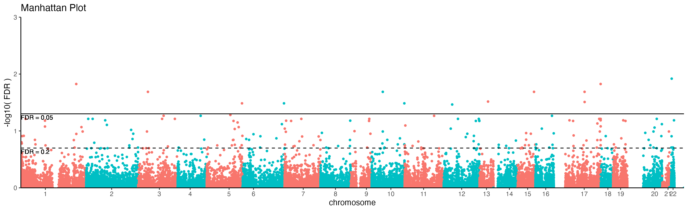

# Background

This workflow identifies differentially methylated probes (DMP) between RSTR / LTBI and then uses these probes to collate differentially methylated regions (DMR). Models are corrected for age, sex, and kinship when available.

# Setup
Load packages

```{r message=FALSE, warning=FALSE}
# Linear regression
library(limma)
library(kimma)

# DMR analysis
library(DMRcate)

#GSEA
library(org.Hs.eg.db)

# Data manipulation and figures
library(tidyverse)
  # Manhattan plots (GitHub package)
  library(ggman)

#Print pretty tables to Rmd
library(knitr)
library(kableExtra)
```

Set seed

```{r}
set.seed(589)
```

# Load data

```{r data}
load("data_Methyl_clean/methyl_data.RData")
probes <- read_csv("data_Methyl_clean/RSTR_probe_features.csv.gz")

ls()
```

# Differential methylation
## Probe-level

Determine differential methylation of probes (DMP) using a linear mixed effects model. See [2.Methyl_model_selection.html](2.Methyl_model_selection.html) for further details.

`~ Sample_Group + M0_KCVSEX + M0_KCVAGE + (1|Sample), varlist=kin`

```{r warning=FALSE}
attach("results/model_selection/kinship_final_model.RData")
DMP.results <- kinship_final$lmerel %>% 
  dplyr::rename(probeID = gene)
```

Calculate average M values for RSTR vs LTBI and merge with probe info and model results.

```{r aves, eval=FALSE}
M.ave <- as.data.frame(RSTR.M.kin) %>% 
  rownames_to_column("probeID") %>% 
  #Convert to long format for calculations
  pivot_longer(-probeID, names_to="Sample_Name", values_to="M") %>% 
  #Add group metadata 
  inner_join(dplyr::select(meta.kin, Sample_Name, Sample_Group), 
            by="Sample_Name") %>% 
  #Calculate mean for each probe in each sample group
  group_by(Sample_Group, probeID) %>% 
  dplyr::summarize(M.ave = mean(M, na.rm=TRUE),
                   M.sd = sd(M, na.rm=TRUE)) %>% 
  ungroup() %>% 
  #Return to wide format
  pivot_longer(M.ave:M.sd) %>% 
  mutate(name = paste(Sample_Group,name,sep=".")) %>% 
  dplyr::select(-Sample_Group) %>% 
  pivot_wider() 

B.ave <- read_csv("data_Methyl_clean/RSTR_clean_beta.csv.gz") %>% 
  #Convert to long format for calculations
  pivot_longer(-probeID, names_to="Sample_Name", values_to="B") %>% 
  #Add group metadata 
  inner_join(dplyr::select(meta.kin, Sample_Name, Sample_Group), 
            by="Sample_Name") %>% 
  #Calculate mean for each probe in each sample group
  group_by(Sample_Group, probeID) %>% 
  dplyr::summarize(B.ave = mean(B, na.rm=TRUE),
                   B.sd = sd(B, na.rm=TRUE)) %>% 
  ungroup() %>% 
  #Return to wide format
  pivot_longer(B.ave:B.sd) %>% 
  mutate(name = paste(Sample_Group,name,sep=".")) %>% 
  dplyr::select(-Sample_Group) %>% 
  pivot_wider()

#####  
DMP.results.all <- DMP.results %>% 
  filter(variable == "Sample_Group") %>% 
  #merge with other data
  left_join(probes, by="probeID") %>% 
  full_join(M.ave, by="probeID") %>% 
  full_join(B.ave, by="probeID") 
```

Save final DMP results.

```{r eval=FALSE}
write.table(DMP.results.all, sep=",", 
            row.names=FALSE, col.names=TRUE,
            file=gzfile("./results/RSTR.DMP.results.csv.gz"))
```

```{r include=FALSE}
DMP.results.all <- read_csv("./results/RSTR.DMP.results.csv.gz")
```

### Visualize DMP
#### Manhatten plot

```{r dmp.viz, warning=FALSE, echo=FALSE}
DMP.man.plot <- ggman(DMP.results.all, snp="SNP_ID", bp="start_hg38",
                      chrom="CHR",
                      pval="FDR",
                      pointSize=1, logTransform=TRUE, 
                      ymax=3, ymin=0, sigLine=NA,
                      relative.positions=TRUE) +
  theme_classic() +
  labs(y = "-log10( FDR )") + 
  geom_hline(yintercept = -log10(0.05)) +
  geom_text(aes(1.3, -log10(0.05), label = "FDR = 0.05", 
                vjust = 1.3, hjust=0), color = "black", size=3) +
  geom_hline(yintercept = -log10(0.2), lty=2) +
  geom_text(aes(1.3, -log10(0.2), label = "FDR = 0.2", 
                vjust = 1.3, hjust=0), color = "black", size=3)

summarize_kmFit(kinship_final$lmerel,
                fdr.cutoff = c(0.05,0.2,0.5))
```



Save plot.

```{r message=FALSE}
# ggsave("figs/DMP_Manhattan_plot.pdf", DMP.man.plot, 
#        width = 13, height=4)
ggsave("figs/DMP_Manhattan_plot.png", DMP.man.plot, 
       width = 13, height=4)
```

#### Individual DMP plots

```{r echo=FALSE}
#Significant DMPs
DMP.signif <- DMP.results.all %>% 
  filter(FDR <= 0.2) %>% 
  distinct(probeID) %>% unlist(use.names = FALSE)
```

Save methylation plots in `figs/DMP_plots/`

```{r mean.dmp.plot, echo=FALSE, eval=FALSE}
dir.create("figs/DMP_plots", showWarnings = FALSE, recursive = TRUE)
dir.create("figs/DMP_plots/FDR.05", showWarnings = FALSE, recursive = TRUE)
dir.create("figs/DMP_plots/FDR.2", showWarnings = FALSE, recursive = TRUE)

for (i in 1:length(DMP.signif)){
  print(i)
  DMP_ID <- DMP.signif[i]
  
  DMP_sub <- DMP.results.all %>% 
    dplyr::filter(probeID==DMP_ID) 
  
  plot.title <- paste(DMP_ID, "\nFDR =", 
                      signif(DMP_sub$FDR, digits=3))
  if(DMP_sub$FDR < 0.05){
    subdir <- "FDR.05/"
  } else {
    subdir <- "FDR.2/"
  }
  
  #### Boxplot ####
  M_sub <- as.data.frame(RSTR.M.kin) %>% 
    rownames_to_column("probeID") %>% 
    filter(probeID==DMP_ID) %>% 
    pivot_longer(-probeID, names_to = "Sample_Name") %>% 
    left_join(meta, by = "Sample_Name")
  
  DMP_M_bplot <- M_sub %>% 
    ggplot(aes(x=Sample_Group, y=value)) +
    geom_boxplot(outlier.shape = NA) +
    geom_jitter(aes(color=Sample_Group), width = 0.2) +
    theme_classic() +
    labs(x="", y="Log2 M value", title=plot.title) +
    theme(legend.position = "none")
  
  filename_B <- paste("figs/DMP_plots/", subdir, DMP_ID, "_DE_M_boxplot.pdf", sep="")
  ggsave(filename_B, DMP_M_bplot, height=4, width=2)
  
  #### Region line plot ####
  DMP_surround <- DMP.results.all %>% 
    dplyr::filter(CHR == unique(DMP_sub$CHR) &
                    start_hg38 >= unique(DMP_sub$start_hg38)-5000 &
                    start_hg38 <= unique(DMP_sub$start_hg38)+5000) %>% 
    dplyr::select(probeID, CHR, start_hg38, FDR, 
                  RSTR.M.ave, LTBI.M.ave) %>% 
    pivot_longer(RSTR.M.ave:LTBI.M.ave, names_to="group", values_to = "M.ave") 
  
  ## Extend surround if too few probes
  if(nrow(DMP_surround)<=5){
    DMP_surround <- DMP.results.all %>% 
      dplyr::filter(CHR == unique(DMP_sub$CHR) &
                      start_hg38 >= unique(DMP_sub$start_hg38)-50000 &
                      start_hg38 <= unique(DMP_sub$start_hg38)+50000) %>% 
      dplyr::select(probeID, CHR, start_hg38, FDR, 
                    RSTR.M.ave, LTBI.M.ave) %>% 
      pivot_longer(RSTR.M.ave:LTBI.M.ave, names_to="group", values_to = "M.ave") 
  }
  
  x_lab <- paste("Chromosome", unique(DMP_surround$CHR), 
                 "position", sep=" ")
  
  DMP_M_plot <- DMP_surround %>% 
    
    ggplot(aes(x=start_hg38, y=M.ave)) +
    geom_point(aes(color=group), size=3) +
    geom_line(aes(color=group)) +
    annotate("text", label="*", size=10, x=DMP_sub$start_hg38, 
             y=max(DMP_sub$LTBI.M.ave, DMP_sub$RSTR.M.ave)+0.2) +
    theme_classic() +
    labs(x=x_lab, y="Average M value", title=plot.title) +
    scale_color_discrete("", labels=c("LTBI.M.ave"="LTBI", 
                                      "RSTR.M.ave"="RSTR"))
  
  filename_M <- paste("figs/DMP_plots/", subdir, DMP_ID, "_DE_M_plot.pdf", sep="")
  ggsave(filename_M, DMP_M_plot, height=7, width=10)
}
```

## Region-level

Several methods are available for the identification of differentially methylated regions (DMR) including Bumphunter, DMRcate, and ProbeLasso. These are compared in detail using 450K methylation data in [Mallik S *et al* 2018](https://academic.oup.com/bib/advance-article/doi/10.1093/bib/bby085/5096828) and [Peters TJ *et al* 2014](https://epigeneticsandchromatin.biomedcentral.com/articles/10.1186/1756-8935-8-6). Of those available in R, DMRcate performed the best and allows co-variate variables.

Thus, using DMRcate, we will identify DMRs around significant probes.

### DMRcate

Run DMRcate on `r length(DMP.signif)` probes with FDR $\leq$ 0.2 and call significant regions with default DMRcate region FDR.

```{r eval=FALSE, echo=FALSE}
DMP.fdr <- 0.2
#Annotate probes
DMR.anno <- cpg.annotate(datatype = "array", 
                         RSTR.M.kin, what="M", 
             arraytype="EPIC", 
             analysis.type = "differential", 
             design = model.matrix(~Sample_Group,
                                   data=meta.kin), 
             contrasts = FALSE, 
             fdr = DMP.fdr, coef = 2) 

#Replace model results with lmerel results
DMR.anno.kin <- DMP.results %>% 
  filter(variable == "Sample_Group") %>% 
  select(probeID, statistic, estimate, FDR)

DMR.anno.kin <- data.frame(probeID = DMR.anno@ranges@ranges@NAMES) %>% 
  left_join(DMR.anno.kin, by="probeID") %>% 
  mutate(is.sig = ifelse(FDR < DMP.fdr, TRUE, FALSE))
  
DMR.anno@ranges@elementMetadata@listData <- list(
  stat = DMR.anno.kin$statistic,
  diff = DMR.anno.kin$estimate,
  ind.fdr = DMR.anno.kin$FDR,
  is.sig = DMR.anno.kin$is.sig)
```

```{r eval=FALSE, echo=FALSE}
#Identify DMRs
DMR.test <- dmrcate(DMR.anno, min.cpgs = 2,
                      #Recommened from Mallik 2018
                      lambda = 500, C = 5)
```

```{r eval=FALSE, echo=FALSE}
#Extract DMR results
DMR.test.ranges <- extractRanges(DMR.test, genome = "hg19")

DMR.test.results <- as.data.frame(DMR.test.ranges) %>% 
  #Create factor for DMR ID
  mutate(DMR = paste("DMR",1:length(DMR.test@coord), sep="_")) %>% 
  #Order variables
  dplyr::select(DMR, seqnames, everything()) %>% 
  mutate(seqnames = gsub("chr","", seqnames)) %>% 
  dplyr::rename(CHR=seqnames) %>% 
  #Replace commes in gene list to allow csv saving
  mutate(overlapping.genes = gsub(", ","/", overlapping.genes)) %>% 
  mutate(min_smoothed_fdr = ifelse(min_smoothed_fdr == 0, 1E-300, 
                                   min_smoothed_fdr))
```

```{r include=FALSE}
load("results/model_selection/DMR_test.RData")
```

This results in only `r nrow(DMR.test.results)` DMR at the auto-generated FDR cutoff of `r max(DMR.test.results$min_smoothed_fdr)`. Thus, a more lenient FDR will be explored. Here, we see all DMR with FDR < 0.05 and select the top.

```{r eval=FALSE, echo=FALSE}
#Identify DMRs
DMR.test2 <- dmrcate(DMR.anno, min.cpgs = 2, pcutoff = 0.05,
                      #Recommened from Mallik 2018
                      lambda = 500, C = 5)
```

```{r eval=FALSE, echo=FALSE}
#Extract DMR results
DMR.test2.ranges <- extractRanges(DMR.test2, genome = "hg19")

DMR.test2.results <- as.data.frame(DMR.test2.ranges) %>% 
  #Create factor for DMR ID
  mutate(DMR = paste("DMR",1:length(DMR.test2@coord), sep="_")) %>% 
  #Order variables
  dplyr::select(DMR, seqnames, everything()) %>% 
  mutate(seqnames = gsub("chr","", seqnames)) %>% 
  dplyr::rename(CHR=seqnames) %>% 
  #Replace commes in gene list to allow csv saving
  mutate(overlapping.genes = gsub(", ","/", overlapping.genes)) %>% 
  mutate(min_smoothed_fdr = ifelse(min_smoothed_fdr == 0, 1E-300, 
                                   min_smoothed_fdr))
```

```{r echo=FALSE}
DMR.fdr <- 1E-70

ggplot(DMR.test2.results) +
  aes(x=1, y=-log10(min_smoothed_fdr)) +
  geom_violin() +
  geom_hline(yintercept = -log10(DMR.fdr), color="red") +
  geom_text(aes(1.3, -log10(DMR.fdr), label = paste("FDR =", signif(DMR.fdr,3)), 
                vjust = 1.3, hjust=0), color = "red", size=3) +
  theme_classic()
```

```{r eval=FALSE, echo=FALSE}
#Identify DMRs
DMR.output <- dmrcate(DMR.anno, min.cpgs = 2, pcutoff = DMR.fdr,
                      #Recommened from Mallik 2018
                      lambda = 500, C = 5)
```

```{r eval=FALSE, echo=FALSE}
#Extract DMR results
DMR.M.ranges <- extractRanges(DMR.output, genome = "hg19")

DMR.M.results <- as.data.frame(DMR.M.ranges) %>% 
  #Create factor for DMR ID
  mutate(DMR = paste("DMR",1:length(DMR.output@coord), sep="_")) %>% 
  #Order variables
  dplyr::select(DMR, seqnames, everything()) %>% 
  mutate(seqnames = gsub("chr","", seqnames)) %>% 
  dplyr::rename(CHR=seqnames) %>% 
  #Replace commes in gene list to allow csv saving
  mutate(overlapping.genes = gsub(", ","/", overlapping.genes)) %>% 
  mutate(min_smoothed_fdr = ifelse(min_smoothed_fdr == 0, 1E-300, 
                                   min_smoothed_fdr))
```

```{r eval=FALSE, include=FALSE}
save(DMR.test.results, DMR.test2.results, DMR.M.results,
     file = "results/model_selection/DMR_test.RData")
```

Thus, we use a new DMR FDR cutoff of `r DMR.fdr`, which results in `r nrow(DMR.M.results)` DMR.

### Annotate DMRs

Extract the probes that occur within significant DMRs. Re-calculate DMR ranges based on hg38 probe mapping.

```{r eval=FALSE, echo=FALSE}
## Index probes based on chromosome and if they fall within the start and end of a signif DMR
index <- apply(DMR.M.results, 1,
               function(x) which(DMP.results.all$CHR == as.character(x["CHR"]) & 
                                 DMP.results.all$MAPINFO >= as.numeric(x["start"]) & 
                                 DMP.results.all$MAPINFO <= as.numeric(x["end"])))
    ## Add back DMR IDs
    names(index) <- DMR.M.results$DMR

index.df <- data.frame(DMR=unname(unlist(sapply(
    names(index), function(x) rep(x,length(index[[x]]))))),
    DMP.results.all[do.call(c,index),]) %>% 
  mutate(CHR = as.character(CHR))
    
DMR.M.results.CpG <- DMR.M.results %>% 
  ## Create label for DMR that each probe is in and combine with probe info
  full_join(index.df, by=c("DMR", "CHR")) %>% 
  #Recalculate DMR based on hg38 probes
  group_by(DMR) %>% 
  mutate(DMR_start = min(start_hg38), DMR_end = max(start_hg38)) %>% 
  ungroup() %>% 
  #Fix annotation group to match ATACseq.
  mutate(annotation.group = ifelse(grepl("TSS", feature), "TSS1500",
                       ifelse(feature %in% c("1stExon","ExonBnd"), "exon",
                        ifelse(feature == "Body", "body",
                                feature)))) %>% 
  #Select, order, and rename
  dplyr::rename(probe_strand = Strand, probe_start = start_hg38,
                DMR_genes=overlapping.genes, probe_genes=gene_HGNC_hg38,
                DMR_FDR=min_smoothed_fdr, probe_FDR=FDR) %>% 
  dplyr::select(DMR, CHR, DMR_start, DMR_end, no.cpgs,
                probeID, probe_strand, probe_start, 
                feature, annotation.group, cgi, DMR_genes, probe_genes, 
                RSTR.M.ave, LTBI.M.ave, DMR_FDR, probe_FDR) 

#Convert DMR results to hg38
DMR.M.results <- DMR.M.results %>% 
  dplyr::rename(DMR_start.hg19 = start, DMR_end.hg19 = end) %>% 
  left_join(distinct(DMR.M.results.CpG, DMR, DMR_start, DMR_end), by = "DMR") %>% 
  dplyr::select(DMR:DMR_end.hg19, DMR_start, DMR_end, everything())
```

#### Save DMR results

```{r eval=FALSE}
write_csv(DMR.M.results, "results/RSTR.DMR.results.csv")

write.table(DMR.M.results.CpG, sep=",", 
            row.names=FALSE, col.names=TRUE,
            file=gzfile("results/RSTR.DMR.results.cpgs.csv.gz"))
```

```{r include=FALSE}
DMR.M.results <- read_csv("results/RSTR.DMR.results.csv")

DMR.M.results.CpG <- read_csv("results/RSTR.DMR.results.cpgs.csv.gz")
```

### Visualize DMR

```{r dmr.viz, warning=FALSE, echo=FALSE}
DMR.man.plot <- DMR.M.results  %>% 
  ggman(., snp="overlapping.genes", bp="DMR_start", 
                      chrom="CHR", pval="min_smoothed_fdr",
        pointSize=1, logTransform=TRUE, ymin=0,#ymax=20, 
        sigLine=NA,
        relative.positions=TRUE) +
  theme_classic() +
  labs(y = "-log10( FDR )") + 
  geom_hline(yintercept = -log10(DMR.fdr)) +
  geom_text(aes(1.3, -log10(DMR.fdr), label = paste("FDR =",DMR.fdr), 
                vjust = 1.3, hjust=0), color = "black", size=3)

DMR.man.plot
```

Save plot.

```{r message=FALSE}
# ggsave("figs/DMR_Manhattan_plot.pdf", DMR.man.plot, 
#        width = 13, height=4)
ggsave("figs/DMR_Manhattan_plot.png", DMR.man.plot, 
       width = 13, height=4)
```

#### Individual DMR plots

Save DMR plots in `/figs/DMR_plots/`

```{r dmr.plot, echo=FALSE, eval=FALSE}
dir.create("figs/DMR_plots/", showWarnings = FALSE)

#Set colors
groups <- c(RSTR="#af8dc3", LTBI="#7fbf7b")
cols <- groups[as.character(meta.kin$Sample_Group)]

for (i in 1:length(DMR.M.results$DMR)){
  print(i)
  DMR_ID <- DMR.M.results$DMR[i]
  
  filename <- paste("figs/DMR_plots/", DMR_ID, 
                    "_plot.pdf", sep="")
  tryCatch({
    pdf(file=filename, height=15, width=8)
      DMR.plot(ranges=DMR.M.ranges,
                     dmr=i, phen.col=cols,
                     CpGs=RSTR.M.kin, what="M", 
                     arraytype="EPIC", 
                     genome="hg19")
  }, error=function(e){})
  
  dev.off()
}
```

```{r mean.dmr.M.plot, echo=FALSE, eval=FALSE}
for (i in 1:length(DMR.M.results$DMR)){
  print(i)
  DMR_ID <- DMR.M.results$DMR[i]
  
#Get DMR info
DMR_sub <- DMR.M.results.CpG %>% 
  dplyr::filter(DMR==DMR_ID) %>% 
  dplyr::select(DMR, CHR, DMR_start, DMR_end, 
                probe_start, probe_FDR, DMR_FDR)

#Expand region around DMR
DMR_surround <- DMP.results.all %>% 
  dplyr::filter(CHR == unique(DMR_sub$CHR) &
         start_hg38 >= unique(DMR_sub$DMR_start)-5000 &
         start_hg38 <= unique(DMR_sub$DMR_end)+5000) %>% 
  dplyr::select(probeID, CHR, start_hg38,
                RSTR.M.ave, LTBI.M.ave) %>% 
  pivot_longer(RSTR.M.ave:LTBI.M.ave, 
               names_to="group", values_to = "M.ave") 

x_lab <- paste("Chromosome", unique(DMR_surround$CHR), 
               "position", sep=" ")
y_min_M <- min(DMR_surround$M.ave)-0.2
  
DMR_M_plot <- DMR_surround %>% 
  
  ggplot(aes(x=start_hg38, y=M.ave)) +
  geom_point(aes(color=group), size=3) +
  geom_line(aes(color=group)) +
  geom_segment(data=DMR_sub, aes(x=DMR_start, xend=DMR_end, 
                   y=y_min_M, yend=y_min_M), 
               color="black", size=2) +
  theme_classic() +
  labs(x=x_lab, y="Average M value", title=DMR_ID) +
  scale_color_discrete("", labels=c("LTBI.M.ave"="LTBI", 
                                "RSTR.M.ave"="RSTR"))

filename_M <- paste("figs/DMR_plots/", DMR_ID, "_DE_M_plot.pdf", sep="")
ggsave(filename_M, DMR_M_plot, height=7, width=10)
}
```

# R session

```{r}
sessionInfo()
```

***